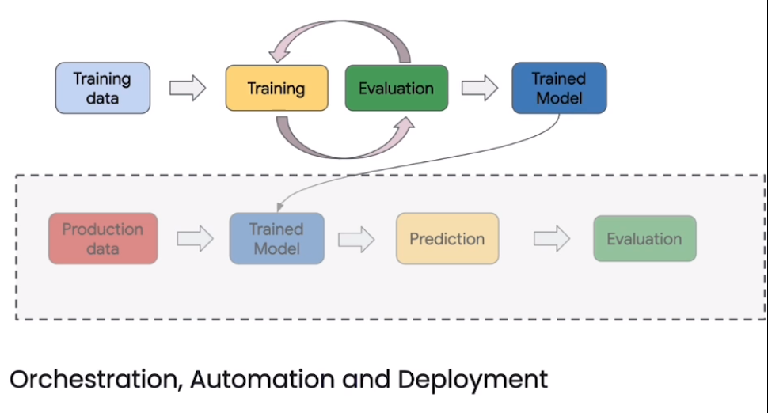

# 🚀 [LLMOps](https://www.deeplearning.ai/short-courses/llmops/)

💻 Welcome to the "LLMOps" course! Instructed by Erwin Huizenga, Machine Learning Technical Lead at Google, this course will guide you through the LLMOps pipeline, enabling you to pre-process training data for supervised instruction tuning and deploy custom Large Language Models (LLMs).

**Course Website**: 📚[deeplearning.ai](https://www.deeplearning.ai/short-courses/llmops/)

 

## Course Summary
In this course, you will dive into the LLMOps pipeline and learn how to adapt it to train and deploy custom LLMs for your specific applications. Here's what you can expect to learn and experience:

1. 🗝 **Fundamentals**: Learn about Data management, Automation and Deployment. This course is about how to build and operate a **${\textsf{\color{red}Model Customization workflow}}$** and how to deploy that into **${\textsf{\color{red}production}}$**.  

 
 

2. 📊 **Pre-processing Training Data**: Retrieve and transform training data for supervised fine-tuning of an LLM.

 

3. 📦 **Versioning Data and Models**: Learn to version your data and tuned models to track tuning experiments effectively. This lab has been implemented in **${\textsf{\color{red}Kubeflow}}$**

 

 
 

4. ⚙️ **Configuring and Executing Supervised Tuning Pipeline**: Configure and execute an open-source supervised tuning pipeline to train and deploy a tuned LLM.

 

5. 📈 **Monitoring Model Behavior**: Output and study safety scores to responsibly monitor and filter your LLM application’s behavior.

 

## Key Points
- 🛠 Adapt an open-source pipeline for supervised fine-tuning of LLMs to better answer user questions.
- 📋 Learn best practices for versioning data and models, and pre-process large datasets inside a data warehouse.
- 🛡️ Practice responsible AI by outputting safety scores on sub-categories of harmful content.

## About the Instructor
🌟 **Erwin Huizenga** is a Machine Learning Technical Lead at Google, bringing extensive expertise to guide you through the LLMOps pipeline.

🔗 To enroll in the course or for further information, visit [deeplearning.ai](https://www.deeplearning.ai/short-courses/).
